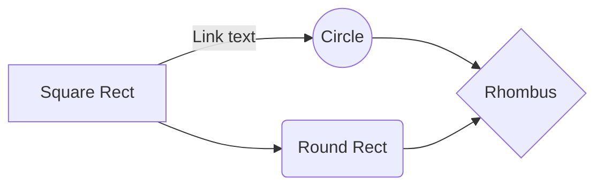

# Markov_Modelling


```mermaid
graph LR
A[Square Rect] -- Link text --> B((Circle))
A --> C(Round Rect)
B --> D{Rhombus}
C --> D
```

# Math

This math is inline `a^2+b^2=c^2`.

This is on a separate line

```math
a^2+b^2=c^2
```


