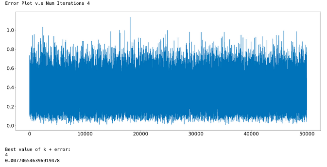

> # Modelling Player Impact in the National Football League
> 
> **STAT 853 Final Project** 
> 
> **By:** Ryker Moreau & Elijah Cavan
> 


___________________________________________________________________________________________________________________________________________________________


# Table of Contents
1. [Introduction](#Introduction)
2. [KMeans](#KMeans)
3. [Markov Model](#Markov-Model)
4. [Results](#Results)
5. [Conclusion](#Conclusion)
6. [References](#References)


# Introduction

The National Football League (NFL) is a place where some of the freakiest athletes ply their trade. Chief among those athletes are the players who are able to play the wide receiver (WR) and defensive back (DB -or CB for cornerback) positions. These positions are tasked with tracking and catching (or in the defense's case-preventing a catch) footballs thrown from the QB (Quarterback) and are largely considered the most impotant positions on the field (other than QB). Below is an image which helps clarify how a typical NFL football game is played:


  
In 2021, the NFL hosted a data science competition called the NFL Big Data Bowl. They tasked competitors with determining the best defenders and wide receivers in the league, and researching what makes these players good at their job. Ryker and I (along with fellow student Brendan Kumagai) already had [some experience](https://operations.nfl.com/updates/football-ops/nfl-announces-finalists-for-fourth-annual-nfl-big-data-bowl/) with the big Data Bowl in 2022, so we decided to look at the 2020 data for our project. The approach for our project largely follows the [paper](https://www.google.com/url?sa=t&rct=j&q=&esrc=s&source=web&cd=&ved=2ahUKEwifzoC6woz3AhXhdc0KHXFmDeEQFnoECAcQAQ&url=https%3A%2F%2Fwww.cs.sfu.ca%2F~oschulte%2Ffiles%2Fpubs%2Fsloan-fix.pdf&usg=AOvVaw0eNIlI-1tbM6Ez4AGPa7yK) of SFU professor Oliver Schulte who presented his work evaluating and clustering NHL (National Hockey League) players at the Sloan Analytics Conference- one of the largest sports analytics conferences held each year. 

His paper is titled, "Apples-to-Apples..." because he wanted to find ways to compare players who do similar actions on the ice (i.e he felt it was wrong to compare defensemen- who's primary task is to defend the net anf make outlet passes to forwards, with forwards- who's job is to keep possession of the puck and create scoring oppertunities in the attacking zone). He used the affinity propagation clustering algorithm with the available event data to create heatmaps which described where a player performs specific actions on the ice the most. After doing this, he created a metric to evaluate the players in each of the clusters using a Markov Model. The markov model helps to positively grade players who preform actions that lead to goals for their team (or prevents goals for the other team). Since some of the actions don't end up of the score sheet (a player wins a puck battle leading to a goal for their team or a defensemen chases down an opposing forward preventing a goal), Schulte's algorithm helps to find and give credit to potentially underrated players. 

Our adaptation of this problem leads to large deviations from the seminal paper. The paper [attacking contributions](https://statsbomb.com/articles/soccer/attacking-contributions-markov-models-for-football/) is a good example of how we have constructed our markov model. We have adapted these methods for a new sport- football, which has quite different positions. We decided to focus in on WRs, TEs (Tight ends) and RBs (running backs) - these are the positions that are able to catch the ball from the QB. The goal of football is that you have 4 downs to gain 10 yards (after those 10 yards your 'downs' reset) after which you change possesions with the opposing team. If you reach the opposing endzone you score a touchdown (you can also kick a field goal which is worth 3 points as opposed to 7 for the touchdown). Thus our markov model looked to credit players who make catches which extend drives (prevent change of possession states) and lead to touchdowns and field goals (these are the 3 absorbing states in our markov chain- field goal, change of possession ('drive ends') and touchdown). Here is an example of a potential "drive" (set of downs) in our data:


For our clustering algorithm we also diverge from Schulte's paper. Whereas Schulte's affinity propagation algorithm doesn't assume an initial cluster number- our KMeans algorithm does need to have a number of clusters specificied a priori. We dealt with this by running the algorithm thousands of times using different pre-specified cluster numbers and picking the iteration where the algorithm has the smallest error.

# KMeans

We clustered our players using the [tracking data](https://www.kaggle.com/c/nfl-big-data-bowl-2021) from the 2021 NFL Big Data Bowl competition. This is a significant divergence from Schulte's paper, who had only event data (where a shot, pass or turnover is made for example). Our tracking data gives us information about the positions of each player on the field. Using this data, we separate each passing play event (each WR 'target' or attempted pass) into bins which are shown below:


Using each of these bins we calculate the success probability for the receiver in each zone (if there is no event in a given bin we assign it a success probability of zero); that is to say the success probability is the number of catches a WR (or TE or RB) has in a specific area of the field divided by the number of times a QB has thrown him the ball in that region of the field. The success probability for each region of the field were the covariates we used in our clustering algorithm to seggregate players. Below is an example of the binned success probabilities for KC Chiefs WR Tyreek Hill (A.K.A Cheetah).


We compare this plot with the heatmap for a typical player in Hill's cluster:


This is confirmation that our clustering algorithm worked well. As outlined in the introduction, we used a K-Means algorithm to preform the clustering. The classical algorithm for KMeans clustering can be outlined as:

1. Prespecify the number of clusters, k
2. Initialize k centroids (cluster means)
3. Calculate the ESS (estimated sum of squares) for each cluster
4. Displace the centroids by recalculating the cluster averge
5. Iterate until optimal ESS is reached (average ESS from each cluster)

For our implementation we took a slight divergence from this algorithm but making use of Monte Carlo simulations. This was because we wanted to use a large number of features in our algorithm (9-10) at the same time- and so our problem was very high dimensional. Our new algorithm can be outlined as such:

1. Make a draw, k, from Uniform(a,b) (a=3, b=8)
2. Initialize k clusters 
3. Calculate the k centroids (cluster means)
4. Determine the cluster ESS 
5. Take the total clustering metric to be max(ESS) - min(ESS) for the k clusters
6. Iterate until optimal total clustering metric is reached

This algorithm is an improvement on the classical KMeans algorithm because we can determine the optimal number of clusters, k, that we should specify to get the best result- which mirrors the advantage in Schulte's paper by using the affinity algorithm. The plot below shows the error over 50,000 draws of k.



We took the error to we the max(ESS) - min(ESS) for the k clusters in order to try to get results in which the ESS was similar for each cluster. i.e we didn't want the case where one cluster has a very small ESS (i.e the players fit well in that cluster) which decrease the average ESS accross the clusters and give us a false sense that each cluster is doing a good job grouping the players. The fact that the optimal number of clusters is 4 is quite encouraging- the number of 'receivers' (players who are able to catch the ball) varies throughout a football game, but the most common formations include 2 WRs, 1 TE and 1 RB. Now that we cluster players based on where they catch the ball, we can compare the players within the clusters using the markov model we developped. 

# Markov Model

A Markov model is a model in which:

```math
P(Xi+1 | X_i X_i-1 ... X_1) = P(X_i+1 | X_i )
```
That is to say we are modelling a stochastic, time varying process by only sampling using information from the prior step in our random walk. For our example, the states we consider are the possible game states an offense experiences during a drive. These states depend on the down, distance to the first down marker and the current field position. There are 4 possible downs. The distance to the first down marker is binned as short (.1-5 yards), medium (6-10 yards) and long (10+ yards). The field position state is also binned as 0-20, 20-40, 40-60 and Redzone, representing the offense having the ball on their own 0-20 yardline, their own 20-40 yardline, ect. Hence possible sates might be 1st and mid 0-20 or 3rd and long 40-60, ect. These states are ended by absorning states (field goal, touch down or change of possession).

The transition probabilities `P(x'|x)` (where x' is the next state and x is the current state) tell us how likely it is for us to change between states (including absorbing states) and can be used to measure the impact of individual players. We calculate the transition probabilities using the same method as in the paper by Schulte, 
```math2
P(x'|x) = n(x',x)/n(x)
```
That is to say, the transition probabilities are approximated as observance counts (`n(x',x)` - how many times we see a particular change in state) divided by the marginal occurance counts (`n(x)` - how many times a particular state has occured). This gives us our maximum likelihood estimates for our markov model. Using the model, we can determine the transition probabilities that are contributed by all of the players we looked at- and estimate their impact by the amount of 'points' they contributed on each play (i.e the amount of value they added increasing the probability an offense will score points, and have a lower probability of 'changing possesions' with the opposing team). The results are summarized in the next chapter.


# Results

Cluster 1:

|Player|EPA_new |EPA |
|----------------|-------------------------------|-----------------------------|
|Hopkins|2.5|2.1 |
|Dude |2.4 |2.7 |
|Dude2  |2.2|2.2|


# Conclusion

# References


