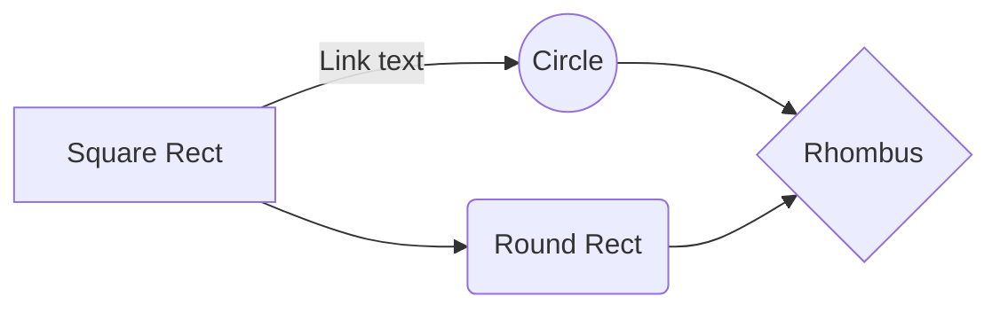

# Evaluating NFL WRs using KMeans & Markov Modelling

By: Ryker Moreau & Elijah Cavan


853 Final Project

___________________________________________________________________________________________________________________________________________________________


# Introduction

The National Football League (NFL) is a place where some of the freakiest athletes ply their trade. Chief among those athletes are the players who are able to play the wide receiver (WR) and defensive back (DB -or CB for cornerback) positions. These positions are tasked with tracking and catching (or in the defense's case-preventing a catch) footballs thrown from the QB (Quarterback) are are largely considered the most impotant positions on the field (other than QB). Below is an image which helps clarify how a typical NFL football game is played:


In 2020, the NFL hosted a data science competition called the NFL Big Data Bowl.


# Markov_Modelling



# Math

This math is inline `a^2+b^2=c^2`.

This is on a separate line

```math
a^2+b^2=c^2
```
# Also

> **Note:** The **Publish now** button is disabled if your file has not been published yet.

# More tricks

|                |ASCII                          |HTML                         |
|----------------|-------------------------------|-----------------------------|
|Single backticks|`'Isn't this fun?'`            |'Isn't this fun?'            |
|Quotes          |`"Isn't this fun?"`            |"Isn't this fun?"            |
|Dashes          |`-- is en-dash, --- is em-dash`|-- is en-dash, --- is em-dash|


