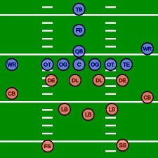
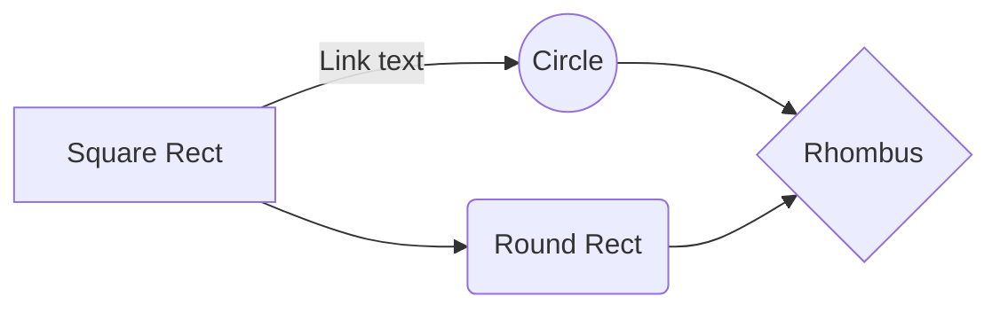

# Evaluating NFL WRs using KMeans & Markov Modelling

By: Ryker Moreau & Elijah Cavan


853 Final Project

___________________________________________________________________________________________________________________________________________________________


# Introduction

The National Football League (NFL) is a place where some of the freakiest athletes ply their trade. Chief among those athletes are the players who are able to play the wide receiver (WR) and defensive back (DB -or CB for cornerback) positions. These positions are tasked with tracking and catching (or in the defense's case-preventing a catch) footballs thrown from the QB (Quarterback) and are largely considered the most impotant positions on the field (other than QB). Below is an image which helps clarify how a typical NFL football game is played:



In 2020, the NFL hosted a data science competition called the NFL Big Data Bowl. They tasked competitors with determining the best defenders and wide receivers in the league, and researching what makes these players good at their job. Ryker and I (along with fellow student Brendan Kumagai) already had [some experience](https://operations.nfl.com/updates/football-ops/nfl-announces-finalists-for-fourth-annual-nfl-big-data-bowl/) with the big Data Bowl in 2022, so we decided to look at the 2020 data for our project. The approach for our project largely follows the [paper](https://www.google.com/url?sa=t&rct=j&q=&esrc=s&source=web&cd=&ved=2ahUKEwifzoC6woz3AhXhdc0KHXFmDeEQFnoECAcQAQ&url=https%3A%2F%2Fwww.cs.sfu.ca%2F~oschulte%2Ffiles%2Fpubs%2Fsloan-fix.pdf&usg=AOvVaw0eNIlI-1tbM6Ez4AGPa7yK) of SFU professor Oliver Schulte who presented his work evaluating and clustering NHL (National Hockey League) players at the Sloan Analytics Conference- one of the largest sports analytics conferences held each year. 

In his paper


# Markov_Modelling



# Math

This math is inline `a^2+b^2=c^2`.

This is on a separate line

```math
a^2+b^2=c^2
```
# Also

> **Note:** The **Publish now** button is disabled if your file has not been published yet.

# More tricks

|                |ASCII                          |HTML                         |
|----------------|-------------------------------|-----------------------------|
|Single backticks|`'Isn't this fun?'`            |'Isn't this fun?'            |
|Quotes          |`"Isn't this fun?"`            |"Isn't this fun?"            |
|Dashes          |`-- is en-dash, --- is em-dash`|-- is en-dash, --- is em-dash|


