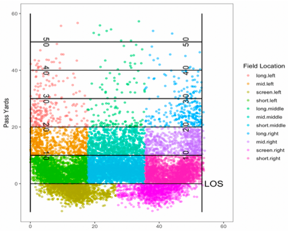
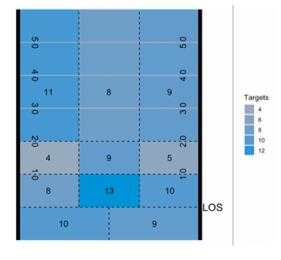

> # Modelling Player Impact in the National Football League
> 
> **STAT 853 Final Project** 
> 
> **By:** Ryker Moreau & Elijah Cavan
> 


__________________________________________________________________________________________________________________________________________________________

link to [slides](https://docs.google.com/presentation/d/1bvzMfxo3721_JdMw8n61vsivoslSwqzKrg_LqV7nLtM/edit?usp=sharing) 

link to [clustering notebook](853_clustering.ipynb)

link to [Markov Model](853_final_prjoect_mc.R)


# Table of Contents
1. [Introduction](#Introduction)
2. [K-Means](#K-Means)
3. [Markov Chains](#Markov-Chains)
5. [Markov Model Application](#Markov-Model-Application)
6. [Adapted K-Means Application](#Adapted-K-Means-Application)
7. [Results](#Results)
8. [Future Work](#Future-Work)
9. [References](#References)

# Introduction

The National Football League (NFL) is a place where some of the freakiest athletes ply their trade. Chief among those athletes are the players who are able to play the wide receiver (WR) and defensive back (DB -or CB for cornerback) positions. These positions are tasked with tracking and catching (or in the defense's case-preventing a catch) footballs thrown from the QB (Quarterback) and are largely considered the most impotant positions on the field (other than QB). Below is an image which helps clarify how a typical NFL football game is played:

An Example of A Football Formation          
:-------------------------:
  
  
In 2021, the NFL hosted a data science competition called the NFL Big Data Bowl. They tasked competitors with determining the best defenders and wide receivers in the league, and researching what makes these players good at their job. Ryker and I (along with fellow student Brendan Kumagai) already had [some experience](https://operations.nfl.com/updates/football-ops/nfl-announces-finalists-for-fourth-annual-nfl-big-data-bowl/) with the big Data Bowl in 2022, so we decided to look at the 2021 data (containing information from the 2018 NFL season) for our project. The approach for our project largely follows the [paper](https://www.google.com/url?sa=t&rct=j&q=&esrc=s&source=web&cd=&ved=2ahUKEwifzoC6woz3AhXhdc0KHXFmDeEQFnoECAcQAQ&url=https%3A%2F%2Fwww.cs.sfu.ca%2F~oschulte%2Ffiles%2Fpubs%2Fsloan-fix.pdf&usg=AOvVaw0eNIlI-1tbM6Ez4AGPa7yK) of SFU professor Oliver Schulte who presented his work evaluating and clustering NHL (National Hockey League) players at the Sloan Analytics Conference- one of the largest sports analytics conferences held each year. 

His paper is titled, "Apples-to-Apples..." because he wanted to find ways to compare players who do similar actions on the ice (i.e he felt it was wrong to compare defensemen- who's primary task is to defend the net and make outlet passes to forwards, with forwards- who's job is to keep possession of the puck and create scoring oppertunities in the attacking zone). He used the affinity propagation clustering algorithm with the available event data to create heatmaps which described where a player performs specific actions on the ice the most. After doing this, he created a metric to evaluate the players in each of the clusters using a Markov Model. The markov model helps to positively grade players who preform actions that lead to goals for their team (or prevents goals for the other team). Since some of the actions don't end up of the score sheet (a player wins a puck battle leading to a goal for their team or a defensemen chases down an opposing forward preventing a goal), Schulte's algorithm helps to find and give credit to potentially underrated players. 

Our adaptation of this problem leads to large deviations from the seminal paper. The paper [attacking contributions](https://statsbomb.com/articles/soccer/attacking-contributions-markov-models-for-football/) is a good example of how we have constructed our markov model. We have adapted these methods for a new sport- football, which has quite different positions. We decided to focus in on WRs, TEs (Tight ends) and RBs (running backs) - these are the positions that are able to catch the ball from the QB. The goal of football is that you have 4 downs to gain 10 yards (after those 10 yards your 'downs' reset) after which you change possesions with the opposing team. If you reach the opposing endzone you score a touchdown (you can also kick a field goal which is worth 3 points as opposed to 7 for the touchdown). Thus our markov model looked to credit players who make catches which extend drives (prevent change of possession states) and lead to touchdowns and field goals (these are the 3 absorbing states in our markov chain- field goal, change of possession ('drive ends') and touchdown). Here is an example of a potential "drive" (set of downs) in our data:


For our clustering algorithm we also diverge from Schulte's paper. Whereas Schulte's affinity propagation algorithm doesn't assume an initial cluster number- our KMeans algorithm does need to have a number of clusters specificied a priori. We dealt with this by running the algorithm thousands of times using different pre-specified cluster numbers and picking the iteration where the algorithm has the smallest error.

# K-Means

The classical K-Means algorithm can be ennumerated as:

  1. Choose a value for k
  2. Initialize k centroids (cluster means) at random 
  3. assign data to each centroid- recalculate
  4. iterate until convergence (or desired loss) is reached


The classical K-means algorithm is simple and computational efficient, and it scales well with large data sets. We chose this algorithm because of the number of features we used in clustering the data (10). We felt that we might have some trouble using a more advanced clustering algorithm due to the high dimensionality of our problem. Fortunately, we made several changes to the classical algorithm to try to make up for some of it's failings, which I will now go into.

The shortcomings of k-means mostly centers around it's assumption that the variance of each variable is spherically distributed. For example, David Robinson (an empirical bayes researcher) [noted](https://stats.stackexchange.com/questions/133656/how-to-understand-the-drawbacks-of-k-means/133694#133694) that this assumption means that there are clear times when you shouldn't use K-means if you know how your data is distributed. The figure below demonstrates how k-means does a poor job v.s agglomerative clustering when the data is not spherically distributed.


K-means            |  Hierarchial Clustering
:-------------------------:|:-------------------------:
  |  


K-means also is meant to create clusters of equal sizes- and doesn't really allow us to make unequal cluster sizes. It also has the disadvantage of requiring us to specify k (the number of clusters) before we begin the algorithm. This means we usually have to run the algorithm multiple times for different values of k to get the best clustering results. 

To evaluate your clustering results, we usually look at two different metrics: the WCSS- within-cluster sum of squares and the BCSS- between cluster sum of squares (i.e we look at how well on average to points belong to their cluster, and how well separated are the clusters). The law of variation tells us the is a tradeoff between these two metrics (similar to the bias-variance tradeoff in regression analysis) because there is only so much variation in the data that can be explained by adding more clusters.

In our section on "K-Means application", we discuss the changes we made to the classical algorithm to try to make up for some of it's shortcomings. 

# Markov Chains

A Markov model satisfies the markov (memory-less) property

```math
P(Xi+1 | X_i X_i-1 ... X_1) = P(X_i+1 | X_i )
```
That is to say we are modelling a stochastic, time varying process by only sampling using information from the prior step in our random walk. The point of using a markov model is to simulate the probability of changing between states. An example of a markov chain is shown in the figure below:

An Example Markov Chain          
:-------------------------:
  

The states of the chain are A,B and C and the arrows indicate the transition probabilities to go from any given state to any other (including itself). Other types of markov models include:

1. Hidden Markov Models
2. Markov Decision processes
3. Partially observed Markov Decision processes

To fully specify the markov chain we require an initilization vector and a transition matrix. The transition matrix is a stochastic matrix (rows sum to 1) which contains all the information about the transition probabilities between states. The initial state vector is determined by taking the product of the transition matrix, P, with the identity matrix. The probability of fututre events is found by taking the mth power of the transition matric, `P^m`. 


# Markov Model Application

For our example, the states we consider are the possible game states an offense experiences during a drive. These states depend on the down, distance to the first down marker and the current field position. There are 4 possible downs. The distance to the first down marker is binned as short (.1-5 yards), medium (6-10 yards) and long (10+ yards). The field position state is also binned as 0-20, 20-40, 40-60 and Redzone, representing the offense having the ball on their own 0-20 yardline, their own 20-40 yardline, ect. Hence possible sates might be 1st and mid 0-20 or 3rd and long 40-60, ect. These states are ended by absorning states (field goal, touch down or change of possession). For example- the figure below shows an example TD drive from the KC Chiefs in the 2018 season. Each set of points represents a different state of the offense as they march down the field for a touchdown.

An Example Football Drive         
:-------------------------:
  

The transition probabilities `P(x'|x)` (where x' is the next state and x is the current state) tell us how likely it is for us to change between states (including absorbing states) and can be used to measure the impact of individual players. We calculate the transition probabilities using the same method as in the paper by Schulte, 
```math2
P(x'|x) = n(x',x)/n(x)
```
That is to say, the transition probabilities are approximated as observance counts (`n(x',x)` - how many times we see a particular change in state) divided by the marginal occurance counts (`n(x)` - how many times a particular state has occured). This gives us our maximum likelihood estimates for our markov model. Once we have our transition matrix, we can calculate the fundamental solution matrix given by:
```math3
F = (I-Q)^(-1)
```
We use this matrix to calculate:
1. Expected number of plays remaining in a drive given the current state
2. Probability of absorption (field goal, touchdown or possession change)
3. Expected Points Added (EPA) of each play given the previous state

I.e, using the model, we can determine the transition probabilities that are contributed by all of the players we looked at- and estimate their impact by the amount of 'points' they contributed on each play (i.e the amount of value they added increasing the probability an offense will score points, and have a lower probability of 'changing possesions' with the opposing team). However, following the paper by Schulte we didn't want to compare players who operate in very different areas of the field- hence in the next section we will talk about how we clustered the players in order to do "apples-to-apples" comparisons of these players. 

# Adapted K-Means Application

We clustered our players using the [tracking data](https://www.kaggle.com/c/nfl-big-data-bowl-2021) from the 2021 NFL Big Data Bowl competition. This is a significant divergence from Schulte's paper, who had only event data (where a shot, pass or turnover is made for example). Our tracking data gives us information about the positions of each player on the field. Using this data, we separate each passing play event (each WR 'target' or attempted pass) into bins by scaling all the plays to begin at the same starting position (LOS- same line of scrimmage). A plot of all the completions for the 2018 season is shown below:


Passing Target Bins        
:-------------------------:
  


Using each of these bins we calculate the number of times a receiver is targeted in each zone in each zone (if there is no event in a given bin we assign zero). These 10 areas of the field (and the number of taregts) a receiver has seen in each zone become the features for our K-Means clustering algorithm. The adapted K-Means algorithm can be summarized as follows:

  1. Draw values of k randomly from Uniform(a,b)
  2. Randomly assign points to clusters
  3. Calculate the centroids, get the BCSS
  4. Determine the optimal value of k from repeated sampling
  5. Re-initialize the algorithm with the new value of k
  6. After the algorithm has converged, recalculate a player’s affinity to each cluster and re-assign as needed

This algorithm takes several divergences from the classical k-means algorithm. For one, we sample randomly from the unform distribution to select different values for k, amd then we determine the value which leads to the optimal BCSS (between cluster sum of squares). This is because while a player's affinity to a given cluster (his distance from the cluster centroid) can vary, the overall BCSS doesn't change as drastically even for different values of k (this is shown in the figure below, along with a plot of how we determined the optimal value of k). 

BCSS v.s WCSS            |  Optimal value of k
:-------------------------:|:-------------------------:
  |  

We also randomly assign the points to a cluster, rather than randomly initializing the centroids- this is not a big change. The other big change is after we re-initialize our algorithm with the optimal value of k, we then go back and calculate a point's affinity to each cluster. This is best explained in the figure below.

Adam Thielan's Affinity to Each Cluster      
:-------------------------:
  

What we noticed was that this WR was assigned to cluster 5 (where we has the 2nd highest affinity) instead of cluster 8. Hence, by re-assigning the points after the algorithm has converged, we are essentially allowing for un-equal cluster sizes, which is another way in which our algorithm has taken a step further from k-means. Now that we cluster players based on where they catch the ball, we can compare the players within the clusters using the markov model we developped, the results are shown in the next section.

# Results

Following Schulte's paper, we can now shown our "apples-to-apples" comparisons of receivers. For example, we looked at 2 players from different clusters; Alvin Kamara (a RB) and Tyreek Hill (a WR). These two players operate in very different areas of the field. For example, Alvin Kamara and his cluster's heatmap are shown in the figure below:

Alvin Kamara's heatmap        |  Alvin Kamara's cluster heatmap
:-------------------------:|:-------------------------:
  |  

Compare this with the cluster results for Hill who operates further down the field from Kamara:

Tyreek Hill's heatmap        |  Tyreek Hill's cluster heatmap
:-------------------------:|:-------------------------:
  |  

Now when we are comparing the passing value attributed to Kamara and Hill, we can compare them to receivers within their own clusters:

Tyreek Hill's Cluster        |  Alvin Kamara's Cluster 
:-------------------------:|:-------------------------:
  |  

As you can see, Kamara offers little value to the passing game as a running back compared to other receivers in his cluster. Hill is one of the top members of his cluster.

# Future Work

In our future work, we plan to continue to work with Markov Models. In particular, we would like to use importance sampling or sequential monte carlo to sove Hidden Markov processes. In particular, we would like to study the effect of blocking during run plays. Classically, a hidden markov model has been used to model the stochastic nature of financial portfolios. The time-varying price variable is actually a process driven by the underlying volatility of the stocks. Similarly, we believe the realization of the running backs yards per carry are driven by the blocking of his offensive line in front of him. The information we learned during this project will help us when we go to implement this hidden markov model.

# References


